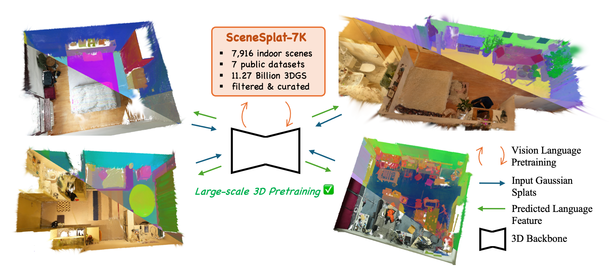

# SceneSplat: Gaussian Splatting-based Scene Understanding with Vision-Language Pretraining - A Minimal Implementation of Inference

<h2 align="left">ICCV 2025 Oral</h2>

[](https://arxiv.org/abs/2503.18052)
[](https://github.com/unique1i/SceneSplat_webpage)
[](https://huggingface.co/datasets/GaussianWorld/scene_splat_7k)

<p align="left">
    
</p>

The minimal inference implementation of our work: <strong>SceneSplat: Gaussian Splatting-based Scene Understanding with Vision-Language Pretraining</strong>. 
Input Gaussian Splats
***

#### $^\star$[Yue Li](https://unique1i.github.io/)<sup>1</sup>, $^\star$[Qi Ma](https://qimaqi.github.io/)<sup>2,3</sup>, [Runyi Yang](https://runyiyang.github.io/)<sup>3</sup>, [Huapeng Li](https://scholar.google.com/citations?user=LkF7__QAAAAJ)<sup>2</sup>, [Mengjiao Ma](https://insait.ai/mengjiao-ma/)<sup>3,4</sup>, $^\dagger$[Bin Ren](https://amazingren.github.io/)<sup>3,5,6</sup>, [Nikola Popovic](https://insait.ai/dr-nikola-popovic/)<sup>3</sup>, [Nicu Sebe](https://disi.unitn.it/~sebe/)<sup>6</sup>, [Ender Konukoglu](https://people.ee.ethz.ch/~kender/)<sup>2</sup>, [Theo Gevers](https://staff.science.uva.nl/th.gevers/)<sup>1</sup>, [Luc Van Gool](https://insait.ai/prof-luc-van-gool/)<sup>2,3</sup>, [Martin R. Oswald](https://oswaldm.github.io/)<sup>1</sup>, and [Danda Pani Paudel](https://insait.ai/dr-danda-paudel/)<sup>3</sup>

$^\star$: Equal Contribution, $^\dagger$: Corresponding Author <br>

<sup>1</sup> University of Amsterdam <br>
<sup>2</sup> ETH Zürich <br>
<sup>3</sup> INSAIT <br>
<sup>4</sup> Nanjing University of Aeronautics and Astronautics <br>
<sup>5</sup> University of Pisa <br>
<sup>6</sup> University of Trento <br>

## Installation

Please set up the provided conda environment with Python 3.10, PyTorch 2.5.1, and CUDA 12.4. 

```bash
conda env create -f env.yaml
conda activate scene_splat
```

## TL;DR
More Details and how to prepare npy data should be refered to <a href=https://github.com/unique1i/SceneSplat>SceneSplat</a>

## Run

### Basic Usage

Run SceneSplat inference on a single scene:

```bash
python run_gs_pipeline.py \
    --data_root example_data \
    --scene_name scene0000_00 \
    --checkpoint /path/to/model_best.pth \
    --device cuda \
    --save_features
```

### Command Options

- `--data_root`: Root directory containing scene data (with structure: `train/`, `val/`, `test/` subdirs)
- `--scene_name`: Scene name to process (e.g., `scene0000_00` for direct folder or `test/scene0000_00` for split-based)
- `--checkpoint`: Path to pretrained SceneSplat model checkpoint (.pth file)
- `--device`: Device to use (`cuda` or `cpu`, default: `cuda`)
- `--save_features`: Save extracted language features to `pred_langfeat.npy`
- `--save_output`: Save input attributes (coord, color, opacity, quat, scale, normal)
- `--output_dir`: Output directory for saved files (default: `./output`)
- `--list_scenes`: List all available scenes in data_root and exit

### Input Data Format

Each scene should be a directory containing these `.npy` files:
```
scene0000_00/
├── coord.npy      # [N, 3] 3D coordinates
├── color.npy      # [N, 3] RGB colors (0-255 or 0-1)
├── opacity.npy    # [N, 1] or [N] opacity values
├── quat.npy       # [N, 4] quaternions (wxyz)
├── scale.npy      # [N, 3] scaling factors
├── normal.npy     # [N, 3] surface normals (optional)
└── segment.npy    # [N] semantic labels (optional)
```

### Output

When `--save_features` is used, the script saves:
- `pred_langfeat.npy`: [N, D] L2-normalized language features (float16)

Features are automatically mapped back to original point order using inverse sampling if available.

### Examples

List available scenes:
```bash
python run_gs_pipeline.py --data_root example_data --list_scenes
```

Process with custom output directory:
```bash
python run_gs_pipeline.py \
    --data_root /path/to/data \
    --scene_name scene0000_00 \
    --checkpoint model_best.pth \
    --save_features \
    --output_dir ./results
```

## Acknowledgement
We sincerely thank all the author teams of the original datasets for their contributions. Our work builds on the following repositories:

- [Pointcept](https://github.com/Pointcept/Pointcept) repository, on which we develop our codebase,
- [gsplat](https://github.com/nerfstudio-project/gsplat) repository, which we adapted to optimize the 3DGS scenes,
- [Occam's LGS](https://github.com/insait-institute/OccamLGS) repository, which we adapted for 3DGS pseudo label collection.

We are grateful to the authors for their open-source contributions!